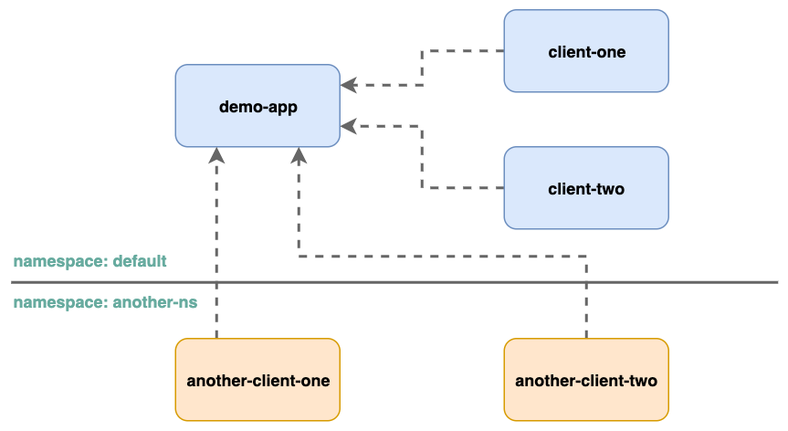

# Amazon EKS Network Policy Demo

In this walkthrough, we will use Nginx application to demo Network Policy functionality in Amazon EKS. It consists of a `demo-app`, `client-one`, and `client-two` applications.

## Overview




## Walkthrough

Deploy the sample k8s deployments across two differnet namespaces

```shell
kubectl apply -f manifests/
```

Verify the deployments

```shell
kubectl get all
```
```
NAME                                 READY    STATUS    RESTARTS         AGE
pod/client-one                        1/1     Running   0                21m
pod/client-two                        1/1     Running   0                21m
pod/demo-app-c5cf4d4b8-ksvsh          1/1     Running   0                21m

NAME                             TYPE           CLUSTER-IP   EXTERNAL-IP                                                                    PORT(S)                     AGE
service/demo-app                 ClusterIP      172.20.199.25    <none>                                                                         80/TCP                      3d12h
service/kubernetes               ClusterIP      172.20.0.1       <none>                                                                         443/TCP                     232d

NAME                                     READY   UP-TO-DATE   AVAILABLE   AGE
deployment.apps/demo-app                  1/1     1            1           21m

NAME                                                DESIRED   CURRENT   READY   AGE
replicaset.apps/demo-app-c5cf4d4b8                   1         1         1       21m
```

```shell
kubectl get all -n another-ns
```
```                                                                          
NAME                         			 READY   STATUS    RESTARTS   AGE
pod/another-client-one   1/1     Running   0          40m
pod/another-client-two  1/1     Running   0          40m

```

## Verify connectivity

By default pods can communicate other pods seamlessely in a k8s cluster. Lets test the connectivity to `demo-app` application from with in the namespace and across namespaces.

Test the connectivity from `client pods` with in & across the namespaces

```shell
kubectl exec -it client-one -- curl --max-time 3 demo-app
kubectl exec -it client-two -- curl --max-time 3 demo-app
kubectl exec -it another-client-one -n another-ns -- curl --max-time 3 demo-app.default
kubectl exec -it another-client-two -n another-ns -- curl --max-time 3 demo-app.default
```

You would see below response for each command, indicating successful API call
```html
<!DOCTYPE html>
<html>
  <head>
    <title>Welcome to Amazon EKS!</title>
    <style>
        html {color-scheme: light dark;}
        body {width: 35em; margin: 0 auto; font-family: Tahoma, Verdana, Arial, sans-serif;}
    </style>
  </head>
  <body>
    <h1>Welcome to Amazon EKS!</h1>
    <p>If you see this page, you are able successfully access the web application as the network policy allows.</p>
    <p>For online documentation and installation instructions please refer to
      <a href="https://docs.aws.amazon.com/eks/latest/userguide/eks-networking.html">Amazon EKS Networking</a>.<br/><br/>
      The migration guides are available at
      <a href="https://docs.aws.amazon.com/eks/latest/userguide/eks-networking.html">Amazon EKS Network Policy Migration</a>.
    </p>
    <p><em>Thank you for using Amazon EKS.</em></p>
</body>
</html>
```

Lets start applying the k8s Network policies to control traffic flow between different apps.

### Block all traffic to Demo app

```shell
kubectl apply -f policies/01-deny-all-ingress.yaml
```
```shell
kubectl exec -it client-one -- curl --max-time 3 demo-app
kubectl exec -it client-two -- curl --max-time 3 demo-app
kubectl exec -it another-client-one -n another-ns -- curl --max-time 3 demo-app.default
kubectl exec -it another-client-two -n another-ns -- curl --max-time 3 demo-app.default
```
All the above calls would timeout 
```
curl: (28) Connection timed out after 3001 milliseconds
command terminated with exit code 28
```

### Allow traffic from Same namespace (default)
```shell
kubectl apply -f policies/02-allow-ingress-from-samens.yaml
```
```shell
kubectl exec -it client-one -- curl --max-time 3 demo-app
kubectl exec -it client-two -- curl --max-time 3 demo-app
kubectl exec -it another-client-one -n another-ns -- curl --max-time 3 demo-app.default
kubectl exec -it another-client-two -n another-ns -- curl --max-time 3 demo-app.default
```
First two commands will succeed, as the network policy is allowing the ingress traffic only with in the `default` namespace.

#### Clean up
```shell
kubectl delete -f policies/02-allow-ingress-from-samens.yaml
```

### Allow traffic from `client-one` app in same namespace
```shell
kubectl apply -f policies/03-allow-ingress-from-samens-client-one.yaml
```
```shell
kubectl exec -it client-one -- curl --max-time 3 demo-app
kubectl exec -it client-two -- curl --max-time 3 demo-app
kubectl exec -it another-client-one -n another-ns -- curl --max-time 3 demo-app.default
kubectl exec -it another-client-two -n another-ns -- curl --max-time 3 demo-app.default
```
Only the first command works, and the other three timeout given the network policy allow access only from `client-one` pod in `default` namespace.

### Allow traffic from `another-ns` namespace
```shell
kubectl apply -f policies/04-allow-ingress-from-xns.yaml
```
```shell
kubectl exec -it another-client-one -n another-ns -- curl --max-time 3 demo-app.default
kubectl exec -it another-client-two -n another-ns -- curl --max-time 3 demo-app.default
```
Now, traffic is allowed from all pods in the `another-ns` namespace.

#### Clean up
```shell
kubectl delete -f policies/04-allow-ingress-from-xns.yaml
```

### Allow traffic from `another-client-one` in `another-ns` namespace
```shell
kubectl apply -f policies/05-allow-ingress-from-xns-client-one.yaml
```
```shell
kubectl exec -it another-client-one -n another-ns -- curl --max-time 3 demo-app.default
kubectl exec -it another-client-two -n another-ns -- curl --max-time 3 demo-app.default
```
Now, traffic is allowed from only `another-client-one` pod in the `another-ns` namespace, and not from `another-client-two` pod.

## Ingress Cleanup

```shell
kubectl delete -f policies/01-deny-all-ingress.yaml
kubectl delete -f policies/02-allow-ingress-from-samens.yaml
kubectl delete -f policies/03-allow-ingress-from-samens-client-one.yaml
kubectl delete -f policies/04-allow-ingress-from-xns.yaml
kubectl delete -f policies/05-allow-ingress-from-xns-client-one.yaml
```

## Egress Example Walkthrough

### Deny all egress from `client-one` pod
```shell
kubectl apply -f policies/06-deny-egress-from-client-one.yaml
```
```shell
kubectl exec -it client-one -- curl --max-time 3 demo-app
```
```
curl: (28) Resolving timed out after 3000 milliseconds
command terminated with exit code 28
```
It fails with timeout error, as `client-one` pod is not able to lookup/resolve the `demo-app` service ip address.

### Allow egress to a specific `port(53)` on `coredns` from `client-one` pod 
```shell
kubectl apply -f policies/07-allow-egress-to-coredns.yaml
```
```shell
kubectl exec -it client-one -- curl --max-time 3 -v demo-app
```
```
*   Trying 172.20.20.101:80...
* Connection timed out after 3000 milliseconds
* Closing connection 0
curl: (28) Connection timed out after 3000 milliseconds
command terminated with exit code 28
```
Now, `client-one` is able to communicate with `coredns` to resolve the service ip of `demo-app`, but failed to connect to `demo-app` due to missing egress rule.

### Allow egress to multiple apps and ports from `client-one` pod
```shell
kubectl apply -f policies/08-allow-egress-to-demo-app.yaml
```
```shell
kubectl exec -it client-one -- curl --max-time 3 demo-app
```
This time, `client-one` is able to resolve the ip address and connect to the `demo-app` on port `80` successfully.

<!--
### Allow egress to an IP CIDR and ports from `client-one` pod
```shell
kubectl apply -f policies/09-allow-egress-to-ip.yaml
```
```shell
kubectl exec -it client-one -- curl --max-time 3 192.168.161.234
```
This time, `client-one` is able to resolve the ip address and connect to the `demo-app` on port `80` successfully.
-->
YaY!!

## Cleanup

```bash
./cleanup.sh
```
## Security

See [CONTRIBUTING](../CONTRIBUTING.md#security-issue-notifications) for more information.

## License

This library is licensed under the MIT-0 License. See the [LICENSE](../LICENSE) file.
