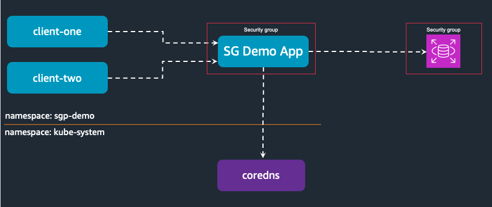

# Amazon EKS Security Groups for Pods & Network Policy Demo

In this walkthrough, we will demostrate how you can utilize both `Security groups for the pods` and `Kubernetes Network Policy` features to secure the pod2pod and pod to other aws resource communications. With `Security groups for the pods` feature you can create and assign purpose built security groups to meet the k8s workload requirements. We will use a sample Nginx application with psql client (`sgpp-demo`) to demo this functionality.

## Overview




## Walkthrough

* Follow the [Creating an Amazon RDS DB Instance](https://docs.aws.amazon.com/AmazonRDS/latest/UserGuide/USER_CreateDBInstance.html) instructions to launch a Amazon RDS Postgres database in the EKS Cluster VPC.

* export the following variables from the above step

  ```shell
  export RDS_HOST=<<Your RDS Database host name>>
  export RDS_SG=<<Your RDS Database Security group>>
  export EKS_CLUSTER=<<Your EKS Cluster Name>>
  export AWS_REGION=<<Your AWS Region>>
  ```

Create the k8s secret with Amazon RDS DB credentials
```shell
kubectl apply -f manifests/00-namespace.yaml
kubectl create secret generic db-creds -n sgp-demo --from-literal=username=<<YOUR_POSTGRES_DB_USER>> --from-literal=password=<<YOUR_POSTGRES_DB_PASSWORD>>  --from-literal=dbhost=$RDS_HOST
```

Create the Pod Security group to assign it to `sgp-demo` application

```shell
export EKS_SG=$(aws eks describe-cluster --name $EKS_CLUSTER --region $AWS_REGION --query "cluster.resourcesVpcConfig.clusterSecurityGroupId" --output text)
export EKS_VPC=$(aws eks describe-cluster --name $EKS_CLUSTER --region $AWS_REGION --query "cluster.resourcesVpcConfig.vpcId" --output text)
export POD_SG=$(aws ec2 create-security-group --group-name sgp-pod-sg --description "SGP Demo Security Group" --vpc-id $EKS_VPC --query "GroupId" --output text)
```

Deploy the sample k8s deployment and SecurityGroupPolicy

```shell
sed -i -e s/POD_SG/$POD_SG/g manifests/01-sg-policy.yaml
sed -i -e s/EKS_SG/$EKS_SG/g manifests/01-sg-policy.yaml
kubectl apply -f manifests/
```

Verify the deployments

```shell
kubectl get all -n sgp-demo
```
```
NAME             READY   STATUS    RESTARTS   AGE
pod/client-one   1/1     Running   0          3m30s
pod/sgp-demo     1/1     Running   0          3m49s

NAME                   TYPE        CLUSTER-IP      EXTERNAL-IP   PORT(S)   AGE
service/sgp-demo-svc   ClusterIP   10.100.58.189   <none>        80/TCP    3m49s
```

## Verify connectivity

By default pods can communicate other pods seamlessely in a k8s cluster. Lets test the connectivity to `sgp-demo` application from `client-one` and `client-two`.

```shell
kubectl exec -it client-one -n sgp-demo -- curl --max-time 3 sgp-demo-svc
kubectl exec -it client-two -n sgp-demo -- curl --max-time 3 sgp-demo-svc
```

You would see below response for each command, indicating successful API call
```html
<!DOCTYPE html>
<html>
  <head>
    <title>Welcome to Amazon EKS!</title>
    <style>
        html {color-scheme: light dark;}
        body {width: 35em; margin: 0 auto; font-family: Tahoma, Verdana, Arial, sans-serif;}
    </style>
  </head>
  <body>
    <h1>Welcome to Amazon EKS!</h1>
    <p>If you see this page, you are able successfully access the web application as the network policy allows.</p>
    <p>For online documentation and installation instructions please refer to
      <a href="https://docs.aws.amazon.com/eks/latest/userguide/eks-networking.html">Amazon EKS Networking</a>.<br/><br/>
      The migration guides are available at
      <a href="https://docs.aws.amazon.com/eks/latest/userguide/eks-networking.html">Amazon EKS Network Policy Migration</a>.
    </p>
    <p><em>Thank you for using Amazon EKS.</em></p>
</body>
</html>
```

Test the connectivity to `Amazon RDS` database

```shell
kubectl exec -it sgp-demo -n sgp-demo -- ./test-db.sh
```

It would fail as the RDS Security group doesn't have appropriate ingress rules

```output
psql: error: could not translate host name "-c" to address: Name does not resolve
#######################################
#####  DATABASE CONNECTION RESULT #####
#######################################
Database connection failed :(
command terminated with exit code 2
```

Lets add ingress rule to RDS Security group from Pod Security group.

```shell
aws ec2 authorize-security-group-ingress --group-id $RDS_SG --protocol tcp --port 5432 --source-group $POD_SG
```

Test the connectivity to `Amazon RDS` database

```output
#######################################
#####  DATABASE CONNECTION RESULT #####
#######################################
Database connection successful :)
```

Lets start applying the k8s Network policies to control traffic flow between different apps.

### Allow traffic from client-one to sgp-demo app

```shell
kubectl apply -f policies/01-allow-ingress-client-one.yaml
```

Test the connectivity from clients to sgp-demo app.

```shell
kubectl exec -it client-one -n sgp-demo -- curl --max-time 3 sgp-demo-svc
kubectl exec -it client-two -n sgp-demo -- curl --max-time 3 sgp-demo-svc
```

Only `client-one` request will succeed while the `client-two` request fails with below error.

```output
curl: (28) Connection timed out after 3001 milliseconds
command terminated with exit code 28
```

YaY!!

We successfully applied both k8s Network Policy and Security Group for pods to k8s applications and able to control the network communications between the k8s pods and other AWS resources like Amazon RDS Database instances.


## Cleanup

```bash
kubectl delete -f policies/
kubectl delete -f manifests/
```

## Security

See [CONTRIBUTING](../CONTRIBUTING.md#security-issue-notifications) for more information.

## License

This library is licensed under the MIT-0 License. See the [LICENSE](../LICENSE) file.
